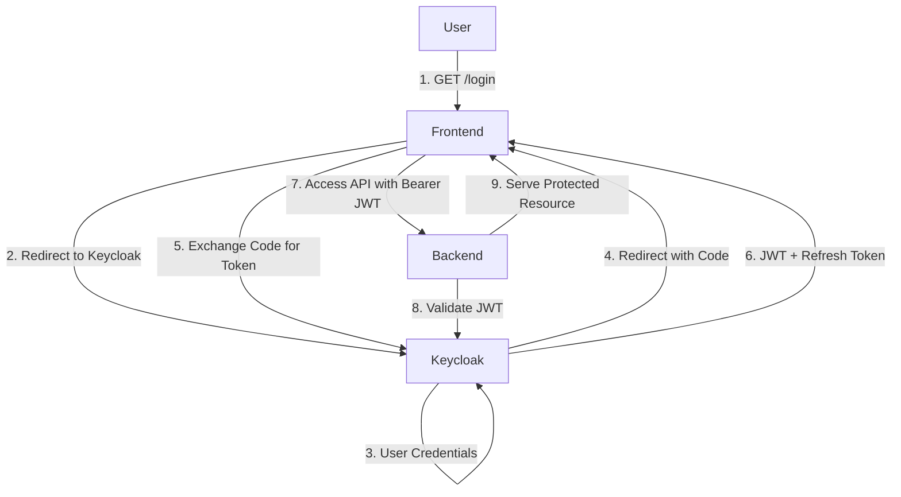

# Authentication Design

This document outlines the **authentication design** for the Bus Ticket Booking System using Keycloak and OAuth2.

---

## 1. Overview

- **Identity Provider**: Keycloak (external)
- **Flow**: OAuth2 Authorization Code Grant
- **Client**: Frontend (redirect-based login)
- **Resource Server**: Spring Boot backend validates JWT

---

## 2. Authentication Flow

---

## 3. Components

- **Keycloak Realm**: `busrealm`
- **Client**: `bus-frontend`, redirect URI configured
- **Roles**: `ROLE_USER`, `ROLE_ADMIN`
- **Token Settings**: Access token lifespan 10m, refresh token lifespan 30m

---

## 4. Redirect-Based Login

1. User visits `/login` on frontend
2. Frontend redirects to Keycloak login page
3. After successful login, Keycloak redirects back with authorization code
4. Frontend exchanges code for JWT + refresh token
5. Frontend stores tokens (e.g., in memory) and uses JWT for API calls

---

* Document Version: 1.0
* Date: 2025-06-23
* Author: ArturChernets
